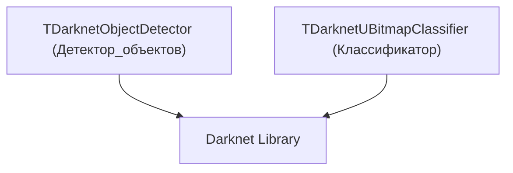
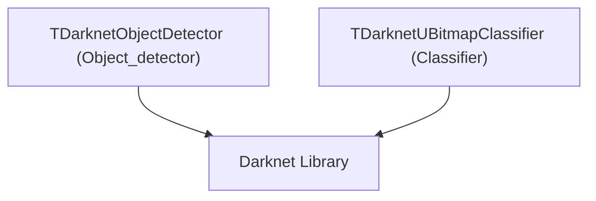

# Архитектура Rdk-DarknetLib

## RU

### Обзор

Rdk-DarknetLib предоставляет компонентный интерфейс для работы с Darknet.

### Структура библиотеки



### Основные модули

#### Детекторы объектов

- **TDarknetObjectDetector** - детектор объектов на основе Darknet/YOLO.
  
  **Основные функции:**
  - Загрузка моделей YOLO
  - Детекция объектов на изображениях
  - Возврат координат и классов объектов

#### Классификаторы

- **TDarknetUBitmapClassifier** - классификатор растровых изображений на основе Darknet

### Ключевые классы

#### DarknetLib

Главный класс библиотеки.

Библиотека загружается при наличии Darknet (условная компиляция).

### Зависимости

- **rdk.static.qt** - ядро Rdk
- **Darknet** - библиотека Darknet
- Заголовочные файлы Darknet

### Особенности

- Интеграция с Darknet для детекции объектов
- Поддержка моделей YOLO
- Работа с изображениями через UBitmap

### Примеры использования

#### Darknet детектор

```cpp
// Создание Darknet детектора
TDarknetObjectDetector* detector = storage->CreateComponent<TDarknetObjectDetector>();
// Загрузка YOLO модели
// Детекция объектов
```

### См. также

- [Usage-Examples.md](Usage-Examples.md) - примеры использования
- [API-Overview.md](API-Overview.md) - обзор API

---

## EN

### Overview

Rdk-DarknetLib provides a component interface for working with Darknet.

### Library Structure



The library provides components that wrap Darknet model loading and inference. Typical usage: load cfg/weights → prepare bitmap input → run detection/classification → expose results via output properties.

### Main Modules

#### Object Detectors

- **TDarknetObjectDetector** - object detector based on Darknet/YOLO.
  
  **Main functions:**
  - Loading YOLO models
  - Object detection on images
  - Returning object coordinates and classes

#### Classifiers

- **TDarknetUBitmapClassifier** - bitmap image classifier based on Darknet

### Key Classes

#### DarknetLib

Main library class.

The library is loaded when Darknet is available (conditional compilation).

### Dependencies

- **rdk.static.qt** - Rdk core
- **Darknet** - Darknet library
- Darknet header files

### Features

- Integration with Darknet for object detection
- Support for YOLO models
- Working with images via UBitmap

### Usage Examples

#### Darknet Detector

```cpp
// Create Darknet detector
TDarknetObjectDetector* detector = storage->CreateComponent<TDarknetObjectDetector>();
// Load YOLO model
// Object detection
```

### See Also

- [Usage-Examples.md](Usage-Examples.md) - usage examples
- [API-Overview.md](API-Overview.md) - API overview
