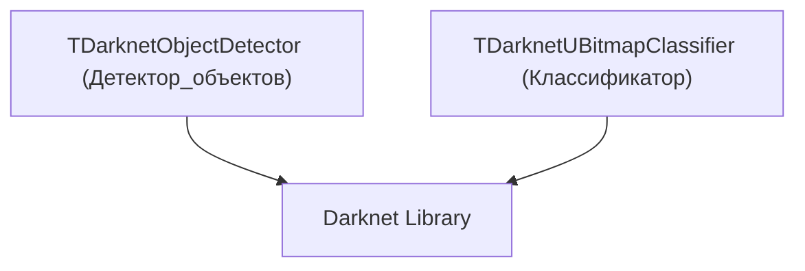
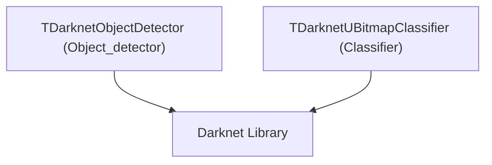

# Архитектура Rdk-DarknetLib

## RU

### Обзор

Rdk-DarknetLib предоставляет компонентный интерфейс для работы с Darknet.

### Структура библиотеки

### Основные модули

#### Детекция объектов

- **TDarknetObjectDetector** - детектор объектов на базе Darknet

#### Классификация

- **TDarknetUBitmapClassifier** - классификатор изображений на базе Darknet

### Зависимости

- `rdk.static.qt` - ядро Rdk
- Darknet - библиотека Darknet

### См. также

- [Usage-Examples.md](Usage-Examples.md) - примеры использования
- [API-Overview.md](API-Overview.md) - обзор API

---

## EN

### Overview

Rdk-DarknetLib provides a component interface for working with Darknet.

### Library Structure

The library provides components that wrap Darknet model loading and inference. Typical usage: load cfg/weights → prepare bitmap input → run detection/classification → expose results via output properties.

### Main Modules

#### Object Detection

- **TDarknetObjectDetector** - Darknet-based object detector

#### Classification

- **TDarknetUBitmapClassifier** - Darknet-based image classifier

### Dependencies

- `rdk.static.qt` - Rdk core
- Darknet - Darknet library

### See Also

- [Usage-Examples.md](Usage-Examples.md) - usage examples
- [API-Overview.md](API-Overview.md) - API overview
