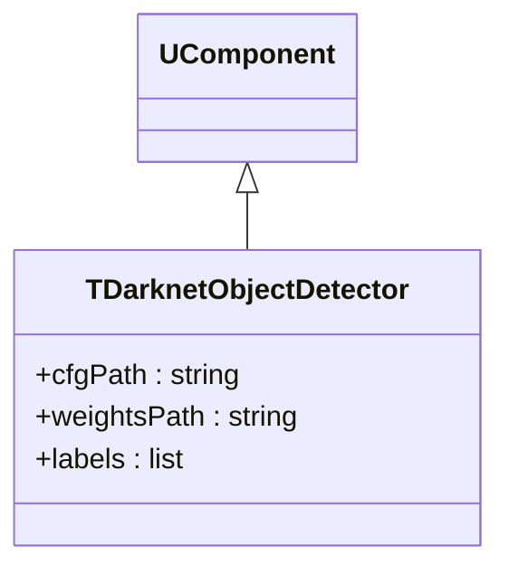
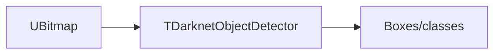
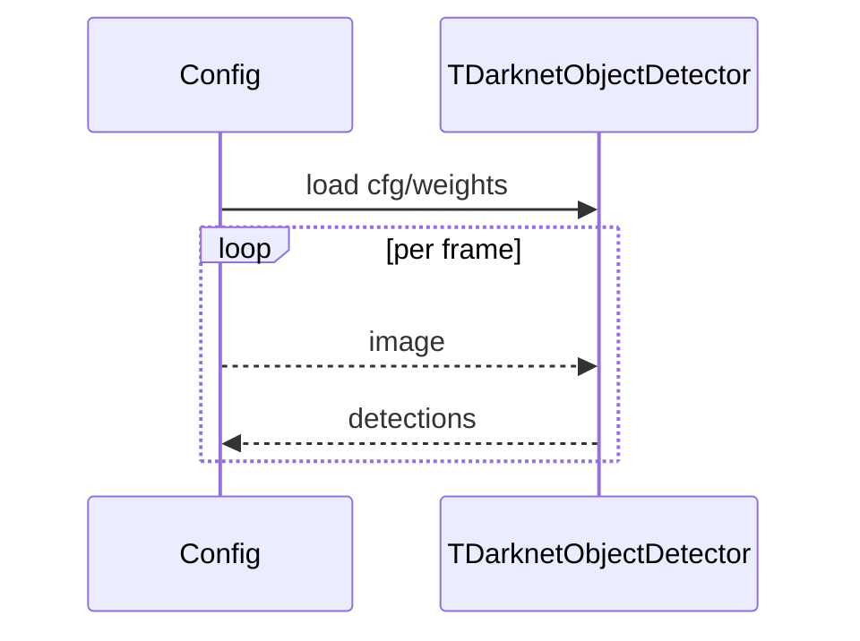

## TDarknetObjectDetector — детектор (YOLO/Darknet)

**Класс**: `TDarknetObjectDetector` (`DarknetObjectDetector`) — детекция объектов с использованием Darknet/YOLO.  
**Регистрация**: `Core/Lib.cpp` → `UploadClass("DarknetObjectDetector", ...)`.  
**Storage-инстансы**: `ClassName = "DarknetObjectDetector"`; параметры: cfg/weights, labels, threshold, NMS.

### Входы/выходы
- Вход: `UBitmap` изображение.
- Выход: bounding boxes, классы, scores.

Пояснение: блок-схема показывает поток данных/сигналов (входы → компонент → выходы).

Пояснение: диаграмма последовательности показывает типовой сценарий взаимодействия и порядок вызовов.

---

## TDarknetObjectDetector — Darknet detector

Runs YOLO/Darknet network on images, outputs detections.
