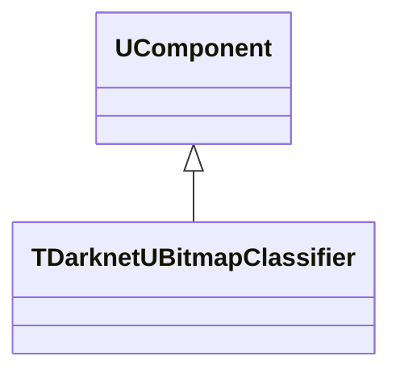
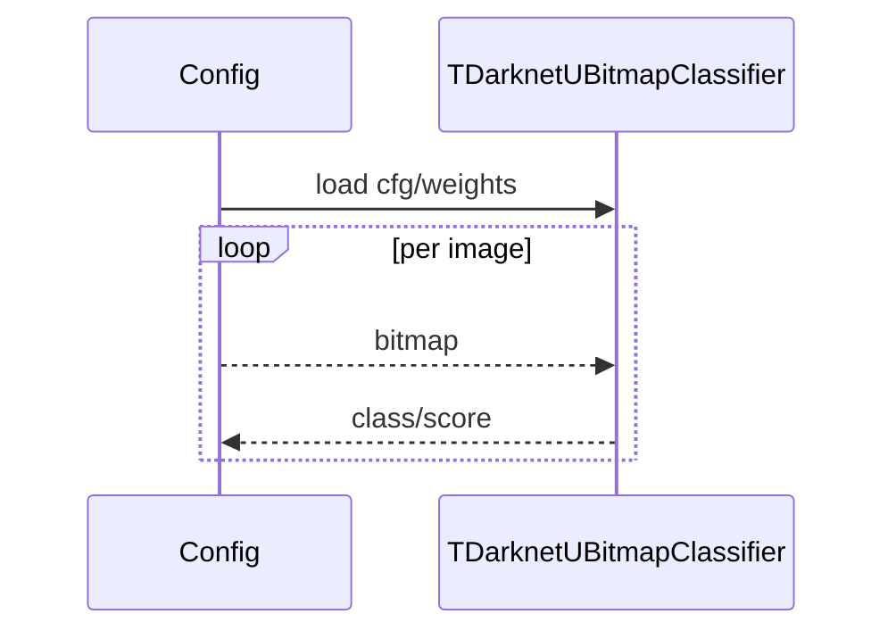

## TDarknetUBitmapClassifier — классификатор Darknet

**Класс**: `TDarknetUBitmapClassifier` (`DarknetUBitmapClassifier`) — классификация bitmap через Darknet.  
**Регистрация**: `Core/Lib.cpp` → `UploadClass("DarknetUBitmapClassifier", ...)`.  
**Storage-инстансы**: `ClassName = "DarknetUBitmapClassifier"`; параметры: cfg/weights, labels.

### Входы/выходы
- Вход: `UBitmap`.
- Выход: класс/скор.

Пояснение: блок-схема показывает поток данных/сигналов (входы → компонент → выходы).

Пояснение: диаграмма последовательности показывает типовой сценарий взаимодействия и порядок вызовов.

---

## TDarknetUBitmapClassifier — Darknet classifier

Classifies bitmaps using Darknet model, returning label/score.
