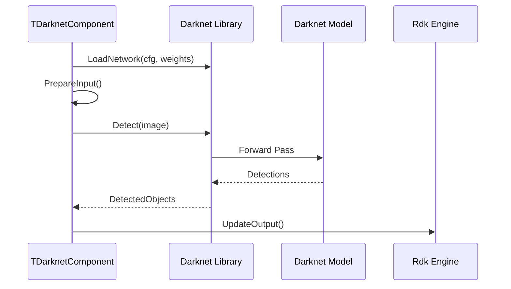

# Пайплайн Darknet

## RU

### Интеграция Darknet с движком

---

Диаграмма демонстрирует процесс детекции объектов через Darknet: компонент загружает сеть из конфигурационного файла (`.cfg`) и файла весов (`.weights`), подготавливает входное изображение, вызывает функцию детекции Darknet, которая выполняет forward pass через модель, и получает список обнаруженных объектов, которые затем обновляются в выходных свойствах компонента для дальнейшей обработки в движке.

## EN

### Darknet Integration with Engine

The diagram demonstrates the object detection process through Darknet: the component loads a network from a configuration file (`.cfg`) and weights file (`.weights`), prepares the input image, calls Darknet's detection function which performs a forward pass through the model, and receives a list of detected objects, which are then updated in component output properties for further processing in the engine.
