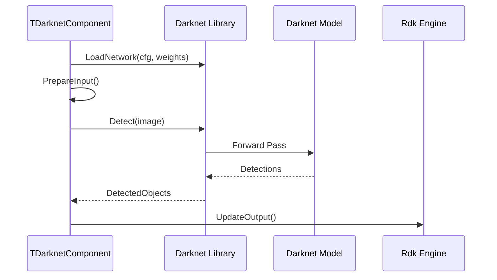

# Пайплайн Darknet

## RU

### Интеграция Darknet с движком

```mermaid
sequenceDiagram
    participant Component as TDarknetComponent
    participant Darknet as Darknet Library
    participant Model as Darknet Model
    participant Engine as Rdk Engine
    
    Component->>Darknet: LoadNetwork(cfg, weights)
    Component->>Component: PrepareInput()
    Component->>Darknet: Detect(image)
    Darknet->>Model: Forward Pass
    Model-->>Darknet: Detections
    Darknet-->>Component: DetectedObjects
    Component->>Engine: UpdateOutput()
```

---

## EN

### Darknet Integration with Engine
